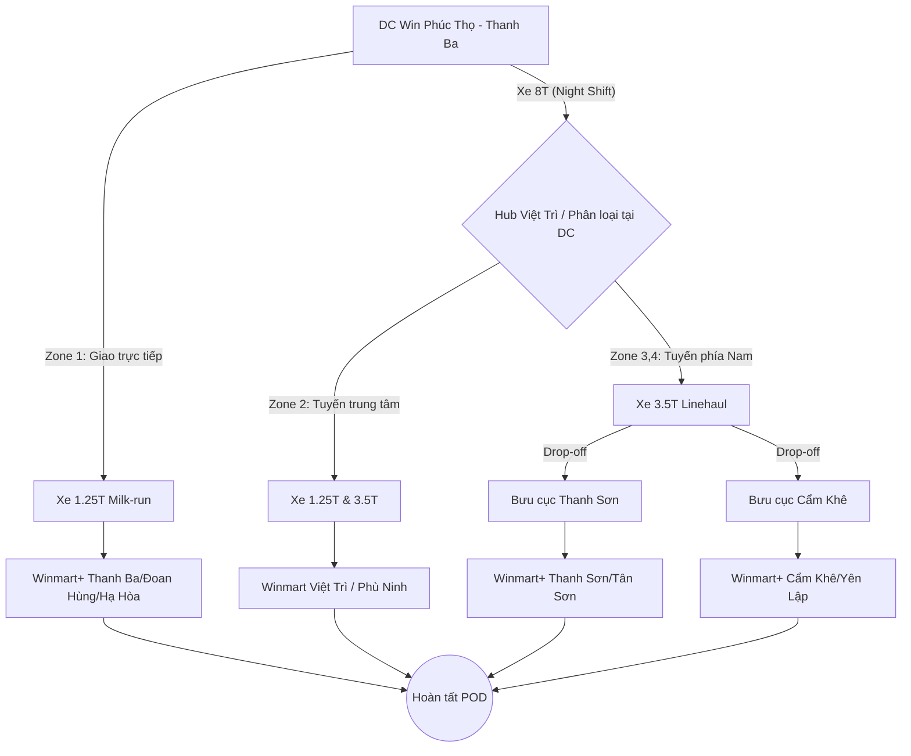

# GIẢI PHÁP VẬN TẢI B2B: DC PHÚ THỌ - HỆ THỐNG WINMART PHÚ THỌ

## 1. Tổng quan yêu cầu
- **Điểm đi:** Kho DC Win Phúc Thọ (Xã Liên Minh, Huyện Thanh Ba, Phú Thọ).
- **Điểm đến:** Hệ thống cửa hàng Winmart & Winmart+ trên toàn tỉnh Phú Thọ (13 Quận/Huyện/Thành phố).
- **Sản lượng:** 8 Tấn/ngày.
- **SLA:** Giao hàng trong vòng 1 ngày (24h).
- **Mục tiêu:** Tối ưu hóa lộ trình từ phía Bắc tỉnh, tận dụng mạng lưới Hub Việt Trì làm điểm trung chuyển cho các Zone phía Nam.

---

## 2. Phân tích Tuyến đường & Địa bàn (Zoning)
Với DC đặt tại **Thanh Ba**, trọng tâm vận hành sẽ dịch chuyển lên phía Bắc tỉnh:

| Vùng | Địa bàn bao phủ | Đặc điểm | Tỷ trọng sản lượng (Dự kiến) |
| :--- | :--- | :--- | :--- |
| **Zone 1 (Immediate)** | H. Thanh Ba, H. Đoan Hùng, H. Hạ Hòa, TX. Phú Thọ | Vùng lân cận DC, giao hàng trực tiếp từ DC. | 30% (2.4 Tấn) |
| **Zone 2 (Core)** | TP. Việt Trì, H. Phù Ninh, H. Lâm Thao | Trung tâm kinh tế, cần linehaul từ DC về Hub Việt Trì. | 40% (3.2 Tấn) |
| **Zone 3 (West)** | H. Cẩm Khê, H. Yên Lập, H. Tam Nông | Chạy dọc tuyến QL32C, giao hàng xuyên tâm. | 15% (1.2 Tấn) |
| **Zone 4 (South)** | H. Thanh Sơn, H. Thanh Thủy, H. Tân Sơn | Xa nhất, cần trung chuyển qua Hub hoặc Bưu cục node phía Nam. | 15% (1.2 Tấn) |

---

## 3. Mô hình Vận hành Đề xuất: Hybrid LTL & Dedicated Milk-run
Thay vì sử dụng xe tải đơn lẻ đi từng điểm (truyền thống), GHN áp dụng mô hình **Cross-docking tại Hub/Bưu cục**:

1.  **Chặng đầu (First Mile):** Xe 8 tấn của GHN lấy hàng từ DC Phú Thọ về **Hub Phú Thọ (Việt Trì)**.
2.  **Chia chọn (Sorting):** Hàng được chia theo Zone ngay tại Hub.
3.  **Chặng giữa (Linehaul nội tỉnh):**
    -   **Zone 1:** Giao trực tiếp bằng xe tải nhỏ (Milk-run).
    -   **Zone 2, 3, 4:** Xe tải trung (3.5 - 5 tấn) trung chuyển hàng đến các **Bưu cục trọng điểm** (Node) tại các huyện.
4.  **Chặng cuối (Last Mile):** Sử dụng đội xe Van hoặc xe tải 1.25 tấn tại Bưu cục để giao đến từng Winmart+.

### Tại sao chọn mô hình này?
- **Tận dụng Network:** Giảm quãng đường chạy rỗng của xe tải lớn.
- **SLA 24h:** Việc chia hàng tại Hub trung tâm giúp các xe Last-mile xuất phát sớm từ 7:00 sáng tại các huyện.
- **Linh hoạt:** Dễ dàng xử lý nếu sản lượng biến động (tăng thêm 1-2 tấn vẫn có thể dùng xe tải hiện có của GHN).

---

## 4. Lịch trình Vận hành Chi tiết (SOP)

| Thời gian | Hoạt động | Ghi chú |
| :--- | :--- | :--- |
| **18:00 - 21:00 (T-0)** | Picking & Packing tại DC Phú Thọ | Winmart chuẩn bị hàng theo đơn. |
| **21:00 - 23:00 (T-0)** | Loading & Transport về Hub Việt Trì | Xe 8 tấn GHN vận chuyển hàng. |
| **23:00 - 03:00 (T+1)** | Sorting & Cross-docking | Chia hàng theo 4 Zone và hạ tải xuống Bưu cục. |
| **04:00 - 07:00 (T+1)** | Linehaul đến các Bưu cục huyện | Xe trung chuyển đưa hàng về các điểm node. |
| **07:30 - 12:00 (T+1)** | **Wave 1 Delivery** | Giao hàng cho các cửa hàng trọng điểm/siêu thị lớn. |
| **13:00 - 17:00 (T+1)** | **Wave 2 Delivery** | Giao hàng cho các Winmart+ vùng sâu/xa. |
| **17:00 - 18:00 (T+1)** | Thu hồi chứng từ (POD) & Hoàn tất | Cập nhật trạng thái lên hệ thống TMS. |

---

## 5. Phân bổ Phương tiện (Fleet Planning)
Để vận chuyển 8 tấn hàng/ngày hiệu quả:

- **Xe Trục (DC -> Hub):** 01 xe 8 Tấn (vận hành ban đêm).
- **Xe Tuyến (Hub -> Zone/Bưu cục):** 02 xe 3.5 Tấn.
- **Xe Giao hàng (Last-mile):**
    -   04 xe 1.25 Tấn (Ưu tiên xe tải thùng kín để bảo quản hàng thực phẩm).
    -   Đội xe Van dự phòng tại các Bưu cục huyện nếu có phát sinh đơn lẻ.

---

## 6. Sơ đồ luồng công việc (Flowchart)

---

## 7. Các chỉ số KPI cần kiểm soát
1.  **SLA Delivery:** >98% (Giao đúng ngày cam kết).
2.  **Time Window:** Giao đúng khung giờ Winmart yêu cầu (thường là trước 10:00 sáng).
3.  **Hao hụt/Hư hỏng:** <0.05% (Đặc thù hàng siêu thị).
4.  **POD Accuracy:** 100% chứng từ được trả về bản cứng hoặc bản điện tử trong 24h.

---
**Người thực hiện:** Solution Design Team - GHN
**Ngày lập:** 10/05/2026
